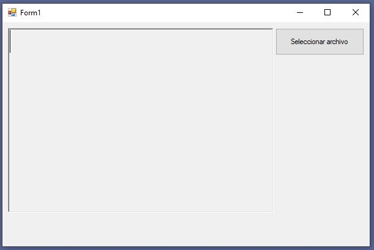
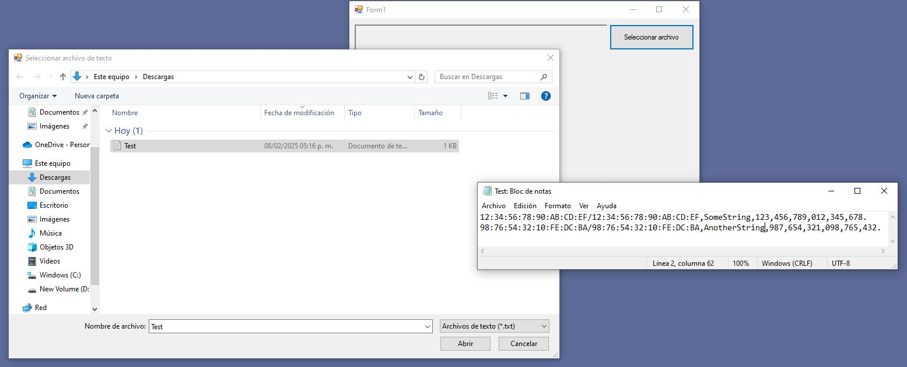
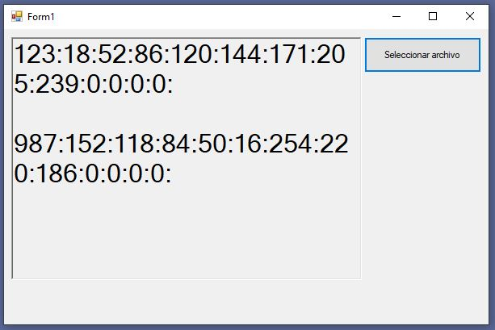

# HexDecConverter

Este proyecto es una aplicación de Windows Forms que permite seleccionar un archivo de texto, procesar su contenido y mostrar los resultados en un `RichTextBox`.

## Requisitos

- .NET Framework 4.7.2
- Visual Studio 2019 o superior

## Estructura del Proyecto
```
.gitattributes
.gitignore
App.config
Form1.cs
Form1.Designer.cs
Form1.resx
Program.cs
Properties/
    AssemblyInfo.cs
    Resources.Designer.cs
    Resources.resx
    Settings.Designer.cs
    Settings.settings
Tarea 1.csproj
Tarea 1.sln
```

## Instalación

1. Clona el repositorio en tu máquina local.
   ```sh
   git clone <URL_DEL_REPOSITORIO>
   ```
2. Abre el archivo `Tarea 1.sln` con Visual Studio.
3. Restaura los paquetes NuGet si es necesario.
4. Compila el proyecto.

## Uso

1. Ejecuta la aplicación.
2. Haz clic en el botón "Seleccionar archivo".
3. Selecciona un archivo de texto (.txt) desde el cuadro de diálogo.
4. El contenido procesado del archivo se mostrará en el `RichTextBox`.

## Capturas de Pantalla

### Pantalla Principal



### Selección de Archivo



### Contenido Procesado



## Funciones Principales

### ConvertHaD
Convierte una cadena hexadecimal a decimal.

```csharp
private string ConvertHaD(string CadHex)
{
    int dec;
    string cadenaDec;
    dec = Convert.ToInt32(CadHex, 16);
    cadenaDec = dec.ToString();
    return cadenaDec;
}
```

### ConvertDaH
Convierte una cadena decimal a hexadecimal.

```csharp
private string ConvertDaH(string dec)
{
    int decimalNumber;
    if (!int.TryParse(dec, out decimalNumber))
    {
        return "0";
    }

    if (decimalNumber < 1)
        return "0";

    int hex = decimalNumber;
    string hexStr = string.Empty;

    while (decimalNumber > 0)
    {
        hex = decimalNumber % 16;

        if (hex < 10)
            hexStr = hexStr.Insert(0, Convert.ToChar(hex + 48).ToString());
        else
            hexStr = hexStr.Insert(0, Convert.ToChar(hex + 55).ToString());

        decimalNumber /= 16;
    }

    return hexStr;
}
```

### button1_Click
Maneja el evento de clic del botón para seleccionar y procesar el archivo.

```csharp
private void button1_Click(object sender, EventArgs e)
{
    int i, y, x;
    string aux = "", numHex = "", numDec = "", Strs = "";
    OpenFileDialog openFileDialog1 = new OpenFileDialog();
    openFileDialog1.Filter = "Archivos de texto (*.txt)|*.txt";
    openFileDialog1.Title = "Seleccionar archivo de texto";

    if (openFileDialog1.ShowDialog() == DialogResult.OK)
    {
        string fileName = openFileDialog1.FileName;
        StreamReader reader = new StreamReader(fileName);
        string line;
        while ((line = reader.ReadLine()) != null)
        {
            i = 0;
            for (y = 0; y < 8; y++)
            {
                while (line[i] != ':' && line[i] != '/')
                {
                    aux += line[i];
                    i++;
                }
                i++;
                numHex += ConvertHaD(aux) + ':';
                aux = "";
            }
            for (y = 0; y < 2; y++)
            {
                while (line[i] != ',') i++;
                i++;
            }
            while (line[i] != ',')
            {
                Strs += line[i];
                i++;
            }
            for (y = 0; y < 3; y++)
            {
                while (line[i] != ',') i++;
                i++;
            }
            for (y = 0; y < 4; y++)
            {
                while (line[i] != '.' && i != line.Length - 1)
                {
                    aux += line[i];
                    i++;
                }
                i++;
                numDec += ConvertDaH(aux) + ':';
                aux = "";
            }
            richTextBox1.Text += Strs + ":" + numHex + numDec + "\n\n";
            aux = numDec = Strs = numHex = "";
        }
        reader.Close();
    }
}
```

## Licencia

Este proyecto está licenciado bajo los términos de la licencia MIT. Para más información, consulta el archivo LICENSE.

